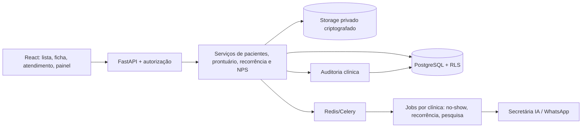
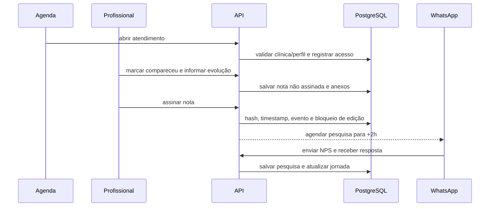
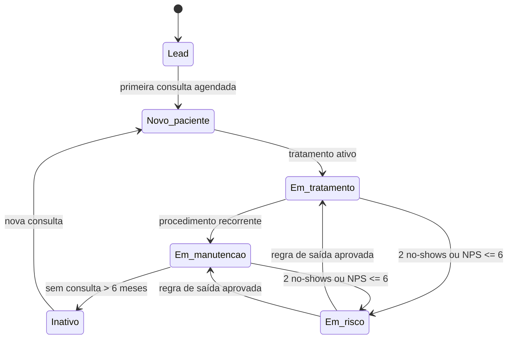
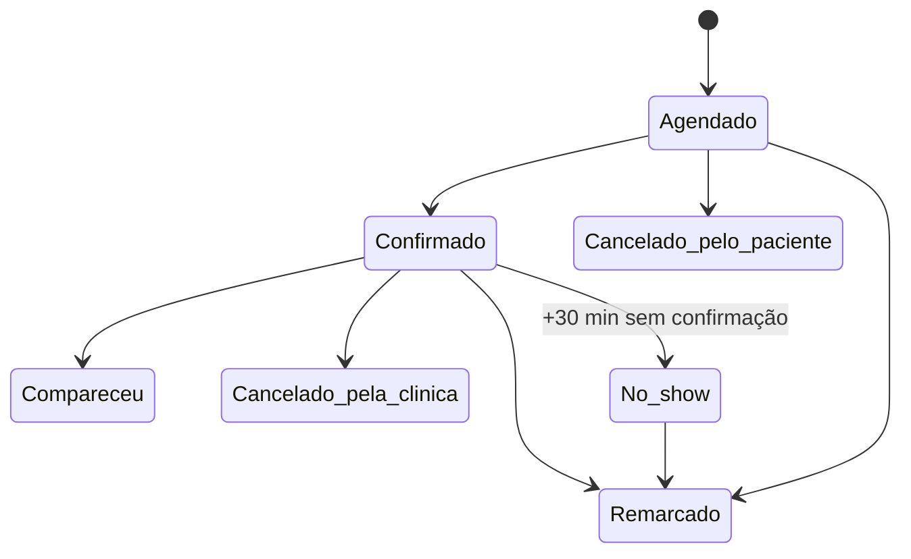
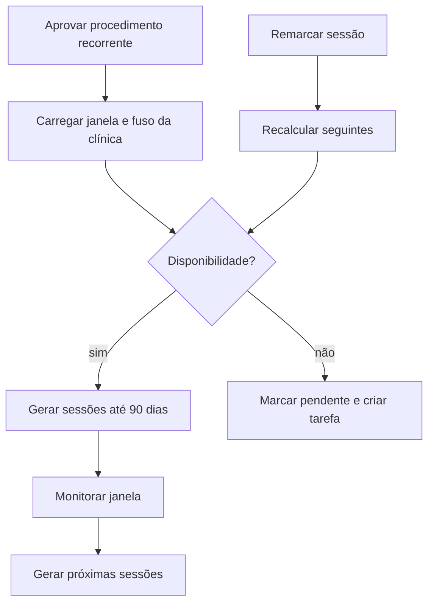
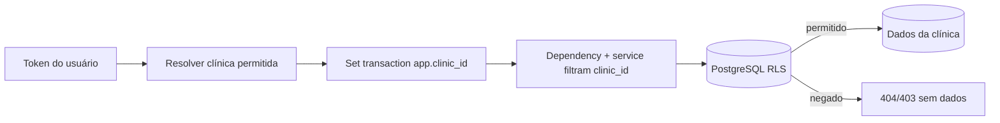

# Fase 3 — Diagramas sistêmicos

## Arquitetura

```mermaid
flowchart LR
  UI[React: lista, ficha, atendimento, painel] --> API[FastAPI + autorização]
  API --> S[Serviços de pacientes, prontuário, recorrência e NPS]
  S --> DB[(PostgreSQL + RLS)]
  S --> ST[(Storage privado criptografado)]
  S --> Q[Redis/Celery]
  Q --> J[Jobs por clínica: no-show, recorrência, pesquisa]
  J --> WA[Secretária IA / WhatsApp]
  S --> AUD[Auditoria clínica]
  AUD --> DB
```

## Fluxo do atendimento

```mermaid
sequenceDiagram
  participant A as Agenda
  participant P as Profissional
  participant API as API
  participant DB as PostgreSQL
  participant WA as WhatsApp
  A->>API: abrir atendimento
  API->>DB: validar clínica/perfil e registrar acesso
  P->>API: marcar compareceu e informar evolução
  API->>DB: salvar nota não assinada e anexos
  P->>API: assinar nota
  API->>DB: hash, timestamp, evento e bloqueio de edição
  API-->>WA: agendar pesquisa para +2h
  WA->>API: enviar NPS e receber resposta
  API->>DB: salvar pesquisa e atualizar jornada
```

## Ciclo de vida do paciente

```mermaid
stateDiagram-v2
  [*] --> Lead
  Lead --> Novo_paciente: primeira consulta agendada
  Novo_paciente --> Em_tratamento: tratamento ativo
  Em_tratamento --> Em_manutencao: procedimento recorrente
  Em_manutencao --> Inativo: sem consulta > 6 meses
  Em_tratamento --> Em_risco: 2 no-shows ou NPS <= 6
  Em_manutencao --> Em_risco: 2 no-shows ou NPS <= 6
  Em_risco --> Em_tratamento: regra de saída aprovada
  Em_risco --> Em_manutencao: regra de saída aprovada
  Inativo --> Novo_paciente: nova consulta
```

## Ciclo do agendamento

```mermaid
stateDiagram-v2
  [*] --> Agendado
  Agendado --> Confirmado
  Confirmado --> Compareceu
  Agendado --> Cancelado_pelo_paciente
  Confirmado --> Cancelado_pela_clinica
  Agendado --> Remarcado
  Confirmado --> Remarcado
  Confirmado --> No_show: +30 min sem confirmação
  No_show --> Remarcado
```

## Recorrência

```mermaid
flowchart TD
  A[Aprovar procedimento recorrente] --> B[Carregar janela e fuso da clínica]
  B --> C{Disponibilidade?}
  C -->|sim| D[Gerar sessões até 90 dias]
  C -->|não| E[Marcar pendente e criar tarefa]
  D --> F[Monitorar janela]
  F --> G[Gerar próximas sessões]
  R[Remarcar sessão] --> H[Recalcular seguintes]
  H --> C
```

## Isolamento por clínica

```mermaid
flowchart LR
  U[Token do usuário] --> X[Resolver clínica permitida]
  X --> C[Set transaction app.clinic_id]
  C --> API[Dependency + service filtram clinic_id]
  API --> RLS[(PostgreSQL RLS)]
  RLS -->|permitido| D[(Dados da clínica)]
  RLS -->|negado| N[404/403 sem dados]
```
